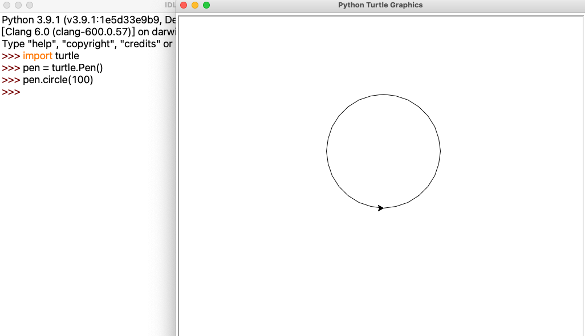
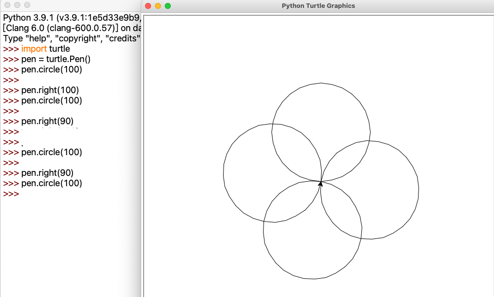
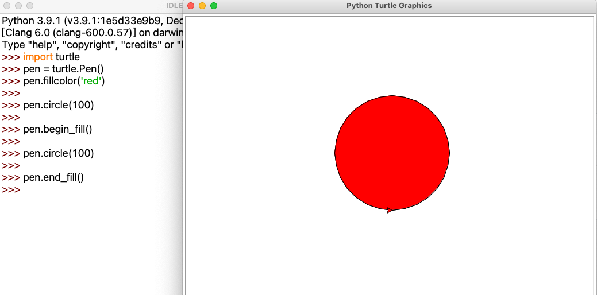

# 课前准备

1. 回顾第2.1讲内容
   1. 数学比较，是否相等  --->真、假
   2. 乌龟作图：改变画笔颜色（pencolor）、改变画笔宽度（pensize）
   3. 巩固：画四边形，三角形
3. 关键词汇复习


# 第2讲 数学类型与乌龟作图

#### 关键词汇

| int      | bool |
| -------- | ---- |
| **type** |      |
|          |      |


## 2.1 整型

整数：0，2，5，100，1000，10000，99999999999，-100， -10000等没有小数部分的数字


在python统称为整型数字，用**int**表示

## 2.2 布尔类型

用布尔类型来表示两种可能值中的一种，通常是真（True）或假（False）

布尔类型只有两种情况，真（True），假（False) ，在python中他们的类型用**bool**表示


#### 比较大小结果 

```python
# 在pyton shell中，检测下述算式的结果：
135 > 50
135 < 50
(135 - 35) > 100
(135 - 35) > 100
(135 - 35) == 100
100 == 90
100 == 100
```

#### 只有两种情况：对 或者 错

| 对     | True      |
| ------ | --------- |
| **错** | **False** |
|        |           |

True，False是python关键字，用来表示真假


## 2.3 类型判断

**type**关键字

想知道python中一个数，或者变量是什么类型，请使用**type()**关键字

```python
type(1)
type(True)

box = 100
type(box)

box = True
type(box)

type('Andy')
name = 'Andy'
type(name)
```

> 在python shell中，输入上面代码，仔细观察输出内容
>

#### 

|       |            |
| ----- | ---------- |
|       | circle     |
| fill  | filecolor  |
| begin | begin_fill |
| end   | end_fill   |


## 2.4 乌龟作图

#### 画圆

```python
import turtle

pen = turtle.Pen()
pen.circle(100)

```



#### 画多个圆

```python
import turtle

pen = turtle.Pen()

pen.circle(100)

pen.right(90)
pen.circle(100)

pen.right(90)
pen.circle(100)

pen.right(90)
pen.circle(100)


```



#### 填充

```python
import turtle

pen = turtle.Pen()

pen.fillcolor('red')
pen.begin_fill()

pen.circle(100)

pen.end_fill()


```




```python
import turtle

pen = turtle.Pen()

pen.color('red')
pen.begin_fill()

pen.circle(100)

pen.end_fill()


```

> 观察上述代码效果
>
> color，fillcolor函数区别  （ 边界）

## 2.5 思考

* 画一个长方形，并填充红色

    分析：

    1. 设置填充颜色fillcolor
    2. 开始填充begin_fill('red')
    3. 画长方形
        1. 画线forward
        2. 左转/右转 left/right
        3. 画线forward
        4. 左转/右转 left/right
        5. 画线forward
        6. 左转/右转 left/right
        7. 画线forward
    4. 结束填充end_fill

* 画三角形，并填充黄色

    分析：

    1. 设置填充颜色fillcolor
    2. 开始填充begin_fill('yellow') 
    3. 画长方形
        1. 画线forward
        2. 左转/右转 left/right 60 度
        3. 画线forward
        4. 左转/右转 left/right 60度
        5. 画线forward
    4. 结束填充end_fill

    ## 2.6 学到了什么？


