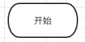

## **什么是流程图**

使用**图形**表示**思路或想法**的一种极好的方法

#### 怎么表示？

用图形表示，你知道哪些图形？

​		正方形，长方形，三角形，菱形，五角形，六边形等等

> 这些图形代表啥意思？

就有一些约定，大家都遵守的约定

首先需要了解有哪些图形，然后每个图像代表什么意思。


## 图形约定（P青106）

#### 椭圆形（开始结束）




> 椭圆形：表示程序的开始或结束

#### 平行四边形（输入输出）


> 平行四边形：表示数据的输入（input）或计算结果的输出
>
> 比如：


#### 长方形（处理）


> 矩形：表示执行，或处理一些工作
>
> 比如：计算 

```python
box = 1 + 1

age = 2021 - 2013

```


#### 菱形（判断）


> 菱形：表示判断
>
> 比如：
>
> 成绩如果大于90，为优秀；小于70，为不合格


#### 箭头（流向）


> 用线段加箭头表示程序流向

## 画流程图

#### 比较大小

1. 要输入两个数
2. 要把输入的数赋值给两个变量
3. 比较两个数的大小
    1. 如果大于，输出 ... 
    2. 否则， 输出 ... 


```python

box = input("请输入整数a: ")
a = int(box)

box = input("请输入整数b: ")
b = int(box)

if a > b:
  print("a is larger")
else:
  print("b is larger")
  
```


#### 计算两个数成绩

1. 输入两个整数
2. 并将两个整数赋值给两个变量，比如a, b
3. 计算 a*b，并将结果赋值给一个变量，不如ab
4. 输出ab的值


```python
box = input("请输入整数a: ")
a = int(box)

box = input("请输入整数b: ")
b = int(box)

ab = a * b

print("a*b结果为："， ab)

```

## 作业

#### 判断奇数还是偶数

1. 输入一个整数
2. 求余数
    1. 余数等于0，输出是偶数
    2. 余数等于1，输出是奇数