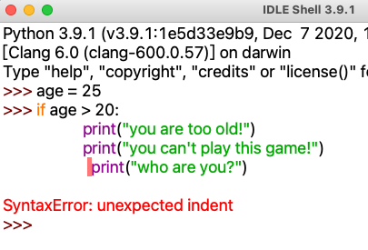

## 缩进

写作文一段的开头，要空两个


那么写代码也一样，有时候要空几个空格


我们在一句代码前，敲几个空格或使用tab键（制表符），称为缩进。

空4个空格，称为缩进4个空格；一般情况下：一个制表符=4个空格


## 语句块

语句块就是组合在一起的代码语句

```python
age = 8

if age < 18:
    print("you are too young!")
    print("you can't computer games!")
    print("you can play basketball!")
```


观察上述代码print语句：相对左边，都缩进了同样数量（4个）空格，称为一个语句块（代码块）---- P（趣46）


只要新起一行，并切用了比前一行多的空格，就开始创建了一个新的语句块（代码块）；这个新建的代码块是前一个代码块的一部分

如图所示


当改变缩进时，其实就是新建新的代码块，如图2


代码块2，代码块3使用了相同的缩进，但是它们不是相同的代码块。因为中间隔着一段缩进较少的代码块


**所以语句块是通过缩进改变的**


注意：代码缩进不一致，咋办？



程序会报语句错误：不是期望的缩进


#### 空格是有意义的

使用空格可以是代码更整洁，更容易阅读。

如果一开始写一段程序并且在代码之前使用了4个空格，那么就应该在程序中其他代码块中也保持使用4个空格。并且要确保使用相同数量的空格缩进。